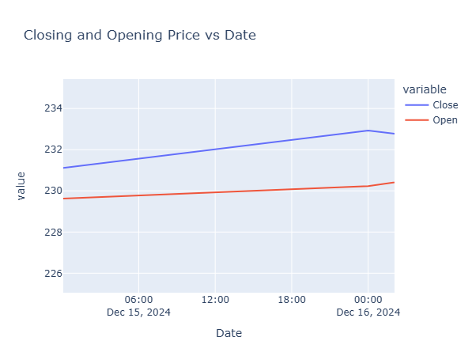
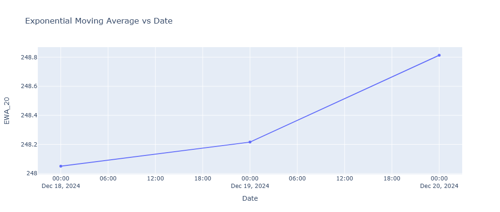
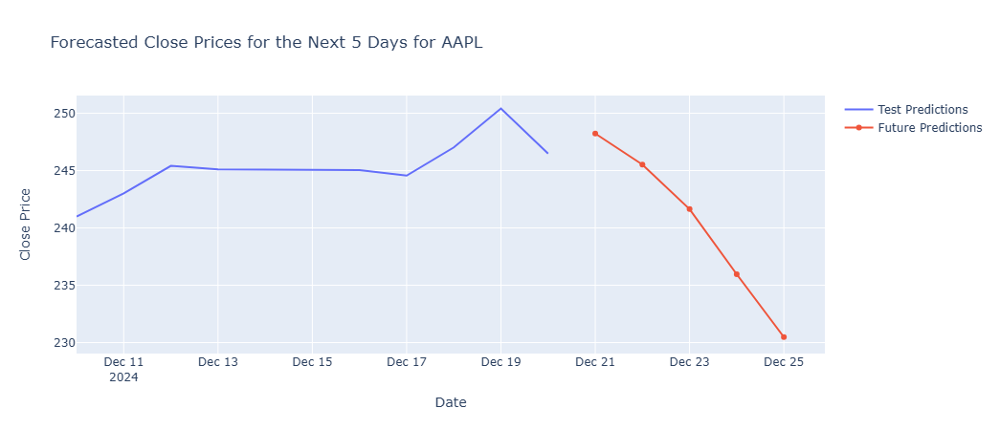

# AI351-Machine-Learning-Project
 

# Visualizing and Predicting Stocks Using Dash  

**Author**: Karrar Ahmed  
**Course**: Machine Learning - AI351  
**Reg**: 2022246  
**Institution**: GIK Institute of Engineering Sciences & Technology, Topi, Khyber Pakhtunkhwa, Pakistan  

---

## Abstract  
Stocks are at the heart of contemporary finance, representing a high-risk/high-return proposition. This project demonstrates the creation of a web application using Dash, a Python framework, to analyze and forecast stock prices. The application integrates real-time data from the `yfinance` library, visualizations powered by Plotly, and predictive modeling through Long Short-Term Memory (LSTM) networks. This tool aims to assist investors by providing real-time stock performance insights and predictions to enhance decision-making.

---

## Features  
- **Interactive Stock Data Visualization**: Real-time line and candlestick charts for trend analysis.  
- **Technical Indicators**: Calculation and graphical representation of moving averages (e.g., EMA).  
- **Stock Price Prediction**: LSTM-based model for short-term price forecasting.  
- **User-Friendly Dashboard**: Built with Dash and styled with Bootstrap and custom CSS.

---

## Technologies Used  
- **Dash**: For developing the interactive web application.  
- **Plotly**: For creating advanced graphical interfaces.  
- **yfinance**: To fetch real-time and historical stock data.  
- **LSTM Networks**: For predicting future stock prices.  
- **Python**: The primary programming language for implementation.

---

## Methodology  
### 1. Application Architecture  
- **Frontend**: Dash components for the UI, styled with Bootstrap and custom CSS.  
- **Backend**: Python scripts using `yfinance` for data fetching and LSTM for predictions.  

### 2. Data Acquisition  
Stock data is obtained through the `yfinance` library, providing historical and real-time market data.  

### 3. Exploratory Data Analysis (EDA)  
- **Data Cleaning**: Address missing values and outliers.  
- **Data Transformation**: Normalize data using MinMaxScaler.  
- **Feature Engineering**: Add moving averages and technical indicators for better predictions.  

### 4. Predictive Modeling  
- LSTM model with two stacked layers trained on historical data.  
- Evaluation metrics include Mean Squared Error (MSE) and Mean Absolute Error (MAE).

---

## Results  
- **Interactive Visualizations**: Dynamic charts displaying stock trends.  
- **Technical Indicators**: Signals for buying or selling based on moving averages.  
- **Prediction Accuracy**: Achieved an MSE of 0.020, ideal for short-term forecasts.  

---

## Application Screenshot  
Below is a screenshot of the web application:   
  
  
  

---

## Future Work  
1. **Sentiment Analysis**: Incorporating news and social media sentiment for enhanced predictions.  
2. **Macroeconomic Indicators**: Adding GDP, interest rates, and other factors to improve modeling.  
3. **Real-Time Trading Integration**: Enable API-based real-time stock trading functionality.

---

## References  
1. Babu, C. N., & Reddy, B. E. (2014). Selected Indian stock predictions using a hybrid ARIMA-GARCH model.  
2. Ding, X., et al. (2015). Deep Learning for Event-Driven Stock Prediction.  
3. Sharma, A., et al. (2017). Survey of Stock Market Prediction Using Machine Learning Approach.  
4. Crio.Do. Predicting Stocks Using Dash: [Crio.Do Projects](https://www.crio.do/projects/python-forecasting-stocks-dash/)  
5. Nature. Deep Learning in Financial Analytics: [Nature Article](https://www.nature.com/articles/s41599-024-02807-x)  

---

## How to Run  
1. Clone the repository:  
   ```bash
   git clone https://github.com/your-repo/stock-visualization-dash.git
   cd stock-visualization-dash
2. Create the environment: venv\Scripts\activate
3. Install the necessary libraries from requirements.txt: pip install -r requirements.txt
4. Run the web_app.py file: python web_app.py
5. Click of the link saying "Dash is running on https://127**********/"
